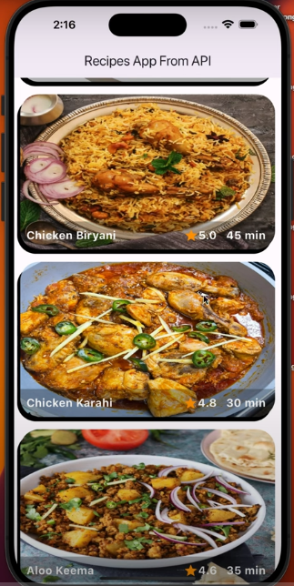
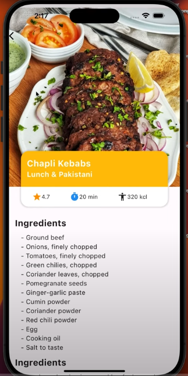

# Flutter Recipe App Using API

## Features

- **Recipe List**: Fetches and displays a list of recipes dynamically from an API.
- **Clean UI Design**: A user-friendly interface designed to showcase recipes elegantly.

## Prerequisites

- **Flutter SDK**: Ensure you have Flutter installed on your system. Follow the [official Flutter installation guide](https://docs.flutter.dev/get-started/install).
- **API Key (if required)**: Obtain an API key for the recipe data source if necessary.

## Screenshots

### Recipe 

### Recipe 

